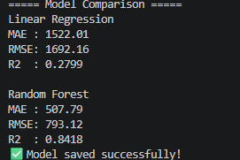
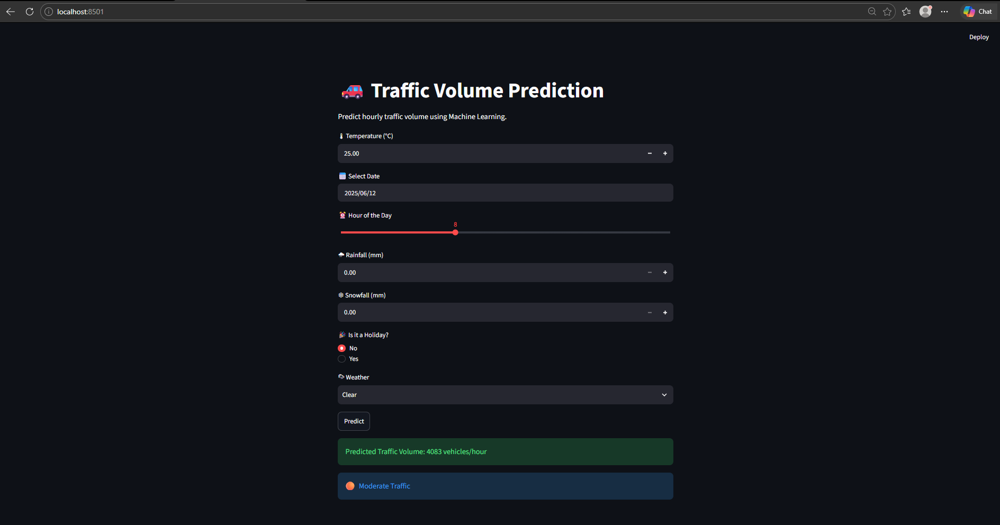

# 🚗 Traffic Volume Prediction using Machine Learning

An end-to-end Machine Learning project that predicts hourly traffic volume based on weather conditions, date, and time using the Metro Interstate Traffic Volume dataset.

## 📌 Features

- Data Cleaning & Preprocessing
- Feature Engineering
- Exploratory Data Analysis (EDA)
- Linear Regression & Random Forest Models
- Model Evaluation (MAE, R² Score)
- Model Serialization using Joblib
- Interactive Streamlit Web Application
- Traffic Volume Prediction

---

## 🛠 Tech Stack

- Python
- Pandas
- NumPy
- Scikit-learn
- Matplotlib
- Streamlit
- Joblib
- Git & GitHub

---

## 📂 Project Structure

```
Traffic Prediction/
│── app.py
│── README.md
│── requirements.txt
│── models/
│── data/
│── src/
```

---

## 🚀 How to Run

1. Clone the repository

```bash
git clone https://github.com/Sakshamsharma012/traffic-prediction.git
```

2. Install dependencies

```bash
pip install -r requirements.txt
```

3. Run the application

```bash
streamlit run app.py
```
## 🤖 Machine Learning Workflow

- Load & Clean Dataset
- Feature Engineering
- Train Multiple Models
- Compare Performance
- Save Best Model
- Build Streamlit App
- Predict Traffic Volume

---

## 📊 Models Used

- Linear Regression
- Random Forest Regressor ✅ (Best Performing Model)

---

## 📷 Screenshots

### Comparsion



## 🚦 Prediction Result



## 🔮 Future Improvements

- Live Weather API
- Google Maps Integration
- Real-time Traffic Prediction
- Cloud Deployment

---
